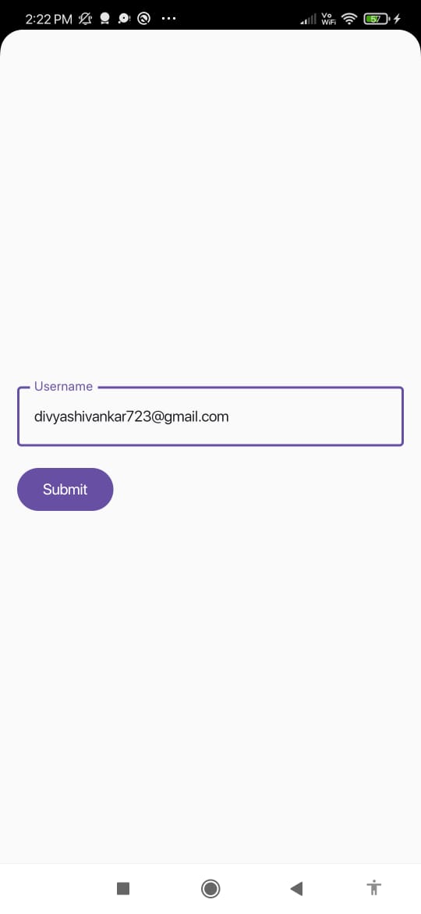

# Simple Android Login App

## 📱 Purpose of the App

This is a simple Android application that allows a user to:
1. Enter a username on a login screen.
2. Navigate to a welcome screen that greets the user with their entered username.

This project demonstrates basic Android development using Jetpack Compose and Navigation.

---

## 🚀 Installation Instructions

### Install the APK on an Android Device

1. Download the APK file: **`app-debug.apk`**.
2. Transfer the APK to your Android device.
3. On your device, open the APK file and tap **Install**.
4. If prompted, enable **"Install from Unknown Sources"** in your device settings.

### Run the Project via Android Studio

1. Open the project in **Android Studio**.
2. Connect a physical device or start an emulator.
3. Click the **Run button** ▶️ or use the shortcut **`Shift + F10`**.

---

## 🌟 Features

- **Login Screen**:
    - Enter a username and click **Submit**.

- **Welcome Screen**:
    - Displays a personalized welcome message:  
      _"Welcome, [Username]!"_

- **Jetpack Compose**:
    - Uses modern UI components with Jetpack Compose for building the interface.

- **Navigation**:
    - Implements simple navigation between screens using **Navigation Compose**.

---

## 🛠️ Dependencies

- **Jetpack Compose**
- **Navigation Compose**
- **Material 3 Design Components**

---

## 📸 Screenshots

| Login Screen                     | Welcome Screen                     |
|----------------------------------|------------------------------------|
|  |  |

---

## 🔗 Additional Resources

- [Android Developer Documentation](https://developer.android.com/get-started/codelabs)
- [Jetpack Compose Navigation Guide](https://developer.android.com/jetpack/compose/navigation)
